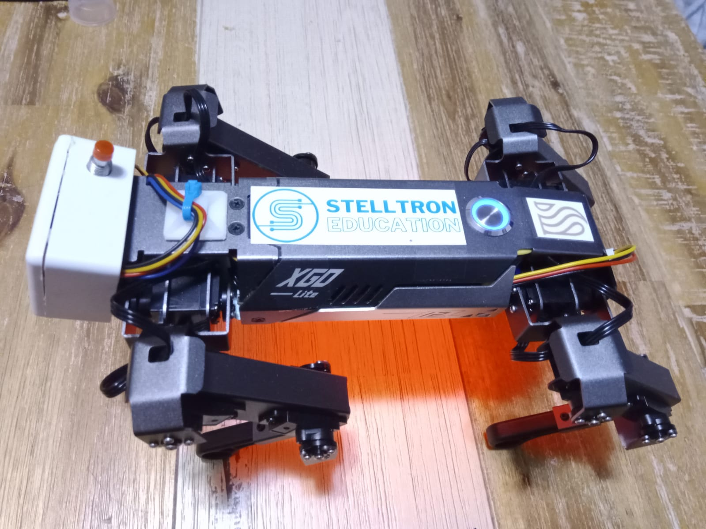

# XGoESP32
 
Robot: XGo Lite, purchased from Stelltron Education. 

Robot name: SAM (Stelltron Automated Mutt)

Makes use of Serial0 (this is defined at the top of send.h and xGo.h)

Add ons:
- Added a DF Robot Beetle ESP32 C3 - RISC-V which this code runs on, and sends commands to SAM.
- Neo pixel

Wiring instructions: 
- PIN 2: neo pixel
- PIN 9: connected to ground through switch, ground on power up to enter flashing mode to upload code.
- PIN 20: RX to SAM
- PIN 21: TX to SAM

Libraries used:
- Adafruit NeoPixel

Code modified from:
- Adafruit NeoPixel example strandtest_wheel
- https://github.com/Xgorobot/mini-pythonlib 
- https://github.com/DeflatedPickle/xgo/tree/2eb56ac9d3cce067436461d3ea573ca003f76b67

Files that you need to include in your project:
- xGo.h
- util/enum/xGo_names.h
- util/enum/send.h

List of functions to use:
- void stop_robot()                                                             :Tested and working.
- int getMode()                                                                 :Tested and working.
- int getBatteryLevel()                                                         :Tested and working.
- Version::Version getVersion()                                                 :Tested and working.
- void setPerformanceMode(Mode::Mode mode)                                      :Tested and working.
- void unmount_all_motors()                                                     :NEED TO TEST
- void unmount_limb(Limb::Limb limb)                                            :NEED TO TEST
- void walk(Direction::Direction direction, int speed)                          :Tested and working. Speed 0-128;
- void rotate(Direction::Direction direction,int speed)                         :Tested and working. Speed 0-128;
- void bodyShift(Direction::Direction direction, int value)                     :Tested and working. value 0-128;
- void setBodyHeight(int height)                                                :Tested and working. Height 0-255;
- int getBodyHeight()                                                           :Tested and working.
- void adjustBodyHeight(int height)                                             :Tested and working. height 0-255;
- void setMaxRotationAngle(Axis::Axis axis, int angle)                          :NEED TO TEST
- void setSteppingHeight(int height)                                            :NEED TO TEST
- void setMovingMode(Speed::Speed speed)                                        :Tested and working.
- void setAction(Action::Action action)                                         :Tested and working.
- void setFootPosition(Limb::Limb limb,int x_pos, int y_pos, int z_pos)         :NEED TO TEST
- void setServoPosition(Limb::Limb limb,int servo1, int servo2, int servo3)     :NEED TO TEST
- void IMU_stabilize(bool val)                                                  :Tested and working. 
- int getIMUAngle(IMU::IMU axis)                                                :NEED TO TEST
- void setBodyRotation(Axis::Axis axis, int period)                             :NEED TO TEST
- int getBodyRotation(Axis::Axis axis)                                          :NEED TO TEST 
- int getSteppingHeight()                                                       :NEED TO TEST
- void stopBodyRotation()                                                       :NEED TO TEST
- void getFootPosition(Limb::Limb limb,int *x_pos, int *y_pos, int *z_pos)      :NEED TO TEST
- void getServoPosition(Limb::Limb limb,int *servo1, int *servo2, int *servo3)  :NEED TO TEST
- void stand()                                                                  :NEED TO TEST               
- void setServoSpeed(Limb::Limb limb,int servo,int speed)                       :NEED TO TEST

Things not coded (suggest using the XGo app to modify these):
- 0x04 Calibration mode (W) 
- 0x13 Bluetooth (W) 
- 0x21 Reset zero position of servo (W)

TODO:
- include send.h into xGo class

